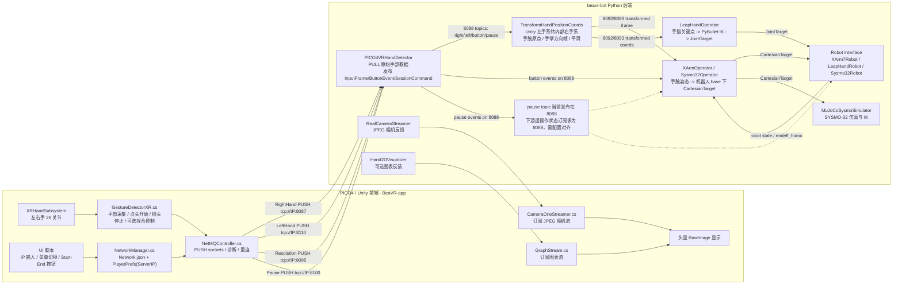
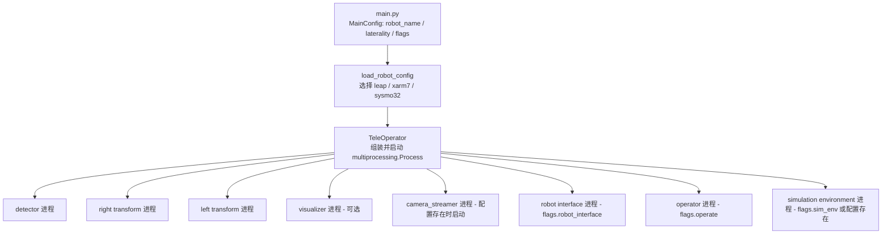

# BeaVR App 当前架构与功能说明

> 整理时间：2026-06-03。本文按当前仓库源码整理，覆盖 `/home/likunwei/dataCollection/BeaVR-app` 的 Unity/PICO4 前端，以及 `/home/likunwei/dataCollection/beavr-bot` 的 Python 遥操作后端。

## 1. 总览

BeaVR 当前不是单独的 Unity 应用，而是一套 VR 遥操作链路：

- `BeaVR-app/BeaVR-Unity`：运行在 PICO4/Quest 类头显上的 Unity 前端，负责采集 XR Hands 26 个手部关节、处理启动/停止手势、显示相机画面，并通过 NetMQ/ZeroMQ 把数据推给后端。
- `beavr-bot`：Python 后端，按机器人配置启动多个独立进程，完成原始手部数据接收、坐标系转换、运动重定向、IK、机器人接口、仿真和相机反馈。
- 主要控制对象：`leap` 灵巧手、`xarm7` 机械臂、`sysmo32` 双臂/MuJoCo 仿真。当前 `leap` 和 `sysmo32` 配置显式使用 PICO4 detector；`xarm7` 配置仍默认走 `OculusVRHandDetector`，使用 PICO4 控制 xarm7 前需要确认 detector 配置已切到 `pico4`。

## 2. 整体架构图



## 3. 后端进程装配图

`beavr-bot/src/beavr/teleop/main.py` 通过 Draccus 读取 CLI/YAML 配置，`TeleOperator` 按机器人配置创建子进程。



## 4. Unity 前端组件

| 组件 | 路径 | 当前职责 |
| --- | --- | --- |
| `GestureDetectorXR` | `BeaVR-app/BeaVR-Unity/Assets/Scripts/Gesture Detection/GestureDetectorXR.cs` | 解析 `XRHandSubsystem`，采集左右手 26 个关节；点头开始、摇头停止；可选左手捏合切换模式；发送手部、分辨率和暂停状态；过滤手丢失和毫米级静止抖动。 |
| `NetMQController` | `Assets/Scripts/Network/NetMQController.cs` | 单例 NetMQ 控制器；创建 `RightHand`、`LeftHand`、`Resolution`、`Pause` 四个 PUSH socket；10ms 发送超时；失败计数和重连；打印发送频率、手腕和 26 关节日志。 |
| `NetworkManager` | `Assets/Scripts/NetworkManager.cs` | 从 `Resources/Configurations/Network.json` 加载端口；从 `PlayerPrefs["ServerIP"]` 覆盖运行时 IP；向 UI/其它组件提供完整 ZMQ 地址。 |
| `SaveAndReturnIP` / `IPFieldManager` | `Assets/Scripts/UI` | 校验并保存服务器 IPv4 到 `PlayerPrefs["ServerIP"]`，返回主界面。 |
| `CameraOneStreamer` | `Assets/Scripts/Camera Stream Scripts/CameraOneStreamer.cs` | 订阅 `camPortNum` 上的 multipart JPEG，更新头显中的 `RawImage`，并把画面固定在视野前方。 |
| `GraphStream` | `Assets/Scripts/GraphStream.cs` | 订阅 `graphPortNum` 上的图像反馈并显示。 |
| `HighResolutionButtonController` / `LowResolutionButtonController` | `Assets/Scripts` | 设置高/低分辨率状态，Unity 每帧通过 `Resolution` socket 发送 `High`、`Low` 或 `None`。 |

## 5. Unity 控制逻辑

### 5.1 数据发送条件

Unity 只有在 `NetMQController.AreSocketsConnected()` 返回 true 后才开始发送控制通道和手部数据。当前连接判定只要求 `RightHand` 和 `LeftHand` 两个 socket 存在。

发送手部数据的开关有两套：

- 头部手势默认启用：点头触发 `relative` 模式并开始遥操作；摇头停止遥操作并发送 `Pause=Low`。
- 左手捏合控制默认由 `EnablePinchStreamingControl` 控制：食指捏合为 `relative` 绿色边框；中指捏合为 `absolute` 蓝色边框；无名指捏合停止并显示菜单。

### 5.2 手部原始消息

当前 Unity 发送的手部 payload 格式为：

```text
relative:x1,y1,z1|x2,y2,z2|...|x26,y26,z26:
absolute:x1,y1,z1|x2,y2,z2|...|x26,y26,z26:
```

说明：

- 每只手 26 个关节，每个关节 3 个浮点数，总计 78 个坐标值。
- 关节顺序是 XR Hands 顺序：`0 Wrist`、`1 Palm`、`2-5 Thumb`、`6-10 Index`、`11-15 Middle`、`16-20 Ring`、`21-25 Little`。
- `PICO4VRHandDetector` 还支持解析带时间戳格式 `HH:MM:SS.ffffff:relative:...`，但当前 `GestureDetectorXR` 发送的是不带时间戳的格式。

## 6. 后端核心链路

### 6.1 Detector：原始输入接收

`PICO4VRHandDetector` 位于 `beavr-bot/src/beavr/teleop/components/detector/vr/pico4.py`。

职责：

- 在 `8087` 接收右手，在 `8110` 接收左手。
- 在 `8095` 接收分辨率按钮，在 `8100` 接收暂停/恢复状态。
- 解析 78 个浮点关键点，拒绝 NaN/Inf、数量错误、所有点几乎重合、手掌关键点退化等无效帧。
- 通过 `ZMQPublisherManager` 在 `8088` 发布类型化对象：
  - `InputFrame(topic=right|left)`：手侧、关键点、相对/绝对模式。
  - `ButtonEvent(topic=button)`：高/低分辨率。
  - `SessionCommand(topic=pause)`：`High` 映射为 `resume`，其它值映射为 `pause`。当前该 topic 发布在 `8088`，而多个 operator/robot interface 的遥操作状态订阅配置是 `8089`，实际使用暂停/恢复前需要把发布和订阅端口对齐。

### 6.2 Transform：坐标和方向帧

`TransformHandPositionCoords` 位于 `beavr-bot/src/beavr/teleop/components/detector/vr/keypoint_transform.py`。

职责：

- 订阅 `8088` 上的 `right` 或 `left` topic。
- 将 Unity 左手系转换为内部右手系：`[x, y, z] -> [x, y, -z]`。
- 将关键点平移到手腕为原点的局部坐标，供手指 IK 使用。
- 使用手腕、食指/中指/小指掌指关节计算稳定手掌方向帧；左手会翻转 palm normal，使左右手输出保持同一右手系约定。
- 对关键点和方向帧做滑动平均，再做正交化。
- 发布两个 topic：
  - `right_transformed_hand_coords` / `left_transformed_hand_coords`：手腕局部关键点。
  - `right_transformed_hand_frame` / `left_transformed_hand_frame`：`[wrist, x_vec, y_vec, z_vec]` 方向帧。

### 6.3 Operator：重定向到目标机器人

机械臂/双臂分支使用 `XArmOperator` 的通用逻辑：

- 首次运行或从暂停恢复时触发 reset：向机器人接口请求当前 `endeff_homo`，同时抓取当前手部方向帧作为初始手姿态。
- 运行中计算 `hand_init_h^-1 @ hand_moving_h` 得到手部相对运动。
- 通过机器人专用 `H_R_V` 将 VR 相对运动映射到机器人 base 坐标系。
- 平移和姿态解耦：位置使用 `robot_init_translation + relative_translation`，姿态使用 `relative_rotation @ robot_init_rotation`。
- 发布 `CartesianTarget(frame_id="base", position_m, orientation_xyzw)`。
- 分辨率控制：`High -> 1.0`，`Low -> 0.6`。

灵巧手分支使用 `LeapHandOperator`：

- 订阅 transformed hand coords。
- 提取 thumb/index/middle/ring 指尖链路。
- 用 `LeapHandIKSolver` 的 PyBullet IK 计算 16 维 LEAP 手关节角。
- 支持冻结或禁用指定手指。
- 发布 `JointTarget(joint_positions_rad)`。

## 7. 机器人配置分支

| `robot_name` | 当前 detector | 主要后端组件 | 输出 |
| --- | --- | --- | --- |
| `leap` | `PICO4VRHandDetector` | `TransformHandPositionCoords` -> `LeapHandOperator` -> `LeapHandRobot` | 16 维 LEAP 手关节角，左右手端口分开。 |
| `sysmo32` | `PICO4VRHandDetector` | `TransformHandPositionCoords` -> `Sysmo32Operator` -> `Sysmo32Robot`，并启动 `MuJoCoSimConfig` 和真实相机 streamer | SYSMO-32 左右臂 CartesianTarget；当前接口层使用 `MockSysmo32Control`，MuJoCo 用 URDF 做仿真。 |
| `xarm7` | 默认 `OculusVRHandDetector` | `TransformHandPositionCoords` -> `XArm7RightOperator/XArm7LeftOperator` -> `XArm7Robot` | xArm7 末端 CartesianTarget；如要使用 PICO4 detector，需要在配置里显式改为 `detector_type="pico4"`。 |
| `xarm7_sim` | 继承 `xarm7` 组件图 | 替换为 sim-enabled `XArm7Robot` | xArm7 仿真接口。 |

## 8. 端口表

### 8.1 Unity 到后端

| 端口 | 名称 | 方向 | 内容 |
| --- | --- | --- | --- |
| `8087` | `RIGHT_HAND_PICO4_PORT` / `rightkeyptPortNum` | Unity PUSH -> Bot PULL | 右手 26 关节原始字符串。 |
| `8110` | `LEFT_HAND_PICO4_PORT` / `leftkeyptPortNum` | Unity PUSH -> Bot PULL | 左手 26 关节原始字符串。 |
| `8095` | `RESOLUTION_BUTTON_PORT` / `resolutionPortNum` | Unity PUSH -> Bot PULL | `High` / `Low` / `None`。 |
| `8100` | `TELEOP_RESET_PORT` / `PausePortNum` | Unity PUSH -> Bot PULL | `High` 表示继续，`Low` 表示暂停。 |

### 8.2 后端内部

| 端口 | 用途 | topic / payload |
| --- | --- | --- |
| `8088` | 原始关键点统一发布 | `right`、`left`、`button`、`pause`，payload 为 `InputFrame` / `ButtonEvent` / `SessionCommand`。 |
| `8089` | xArm/SYSMO/LEAP 接口当前使用的遥操作状态订阅端口 | 多个 operator/robot interface 订阅 `pause` topic；当前 PICO4 detector 默认没有发布到这个端口，需配置或桥接。 |
| `8092` | 右手变换后关键点和方向帧 | `right_transformed_hand_coords`、`right_transformed_hand_frame`。 |
| `8093` | 左手变换后关键点和方向帧 | `left_transformed_hand_coords`、`left_transformed_hand_frame`。 |
| `8119` / `8120` | 右 LEAP 当前角 / 命令角 | `joint_angles`。 |
| `8117` / `8121` | 左 LEAP 当前角 / 命令角 | `joint_angles`。 |
| `10009` / `10010` | xArm7 右臂命令 / 末端状态 | `endeff_coords` / `endeff_homo`。 |
| `10011` / `10012` | xArm7 左臂命令 / 末端状态，或 SYSMO-32 右臂命令 / 状态 | 按当前 `robot_name` 配置使用，不能混用同一端口集。 |
| `10013` / `10014` | SYSMO-32 左臂命令 / 状态 | `endeff_coords` / `endeff_homo` / robot state。 |
| `10005` | 相机反馈 | 后端 PUB multipart JPEG，Unity `CameraOneStreamer` SUB。 |
| `15001` | 2D 图表反馈 | 后端 visualizer PUB 图像，Unity `GraphStream` SUB。 |

### 8.3 当前网络配置文件

`BeaVR-app/BeaVR-Unity/Assets/Resources/Configurations/Network.json` 当前包含：

```json
{
  "IPAddress": "192.168.1.48",
  "rightkeyptPortNum": "8087",
  "leftkeyptPortNum": "8110",
  "camPortNum": "10005",
  "graphPortNum": "15001",
  "resolutionPortNum": "8095",
  "PausePortNum": "8100",
  "LeftPausePortNum": "8107",
  "RightPausePortNum": "8109"
}
```

Unity 启动时会先读这个 JSON；如果用户通过 UI 保存过 IP，则 `PlayerPrefs["ServerIP"]` 会覆盖运行时 IP。后端 `network.HOST_ADDRESS` 当前也是 `192.168.1.48`，需要和实际运行 `beavr-bot` 的机器 IP 保持一致。

## 9. 当前主要功能

- VR 手部追踪：基于 Unity XR Hands，每手 26 个关节，左右手独立采集和发送。
- 遥操作模式控制：点头开始、摇头停止；也支持左手食指/中指/无名指捏合切换相对、绝对、停止模式。
- 网络连接管理：IP UI 保存、标准 socket 创建、诊断测试、发送超时、失败重连、NetMQ 清理。
- 控制通道：分辨率缩放和暂停/恢复状态随连接状态持续发送。
- 坐标处理：Unity 左手系到内部右手系转换，手腕局部关键点，手掌方向帧，滑动平均和平面退化检查。
- 机械臂重定向：手腕相对运动映射到机器人 base 坐标系，输出笛卡尔末端目标。
- 灵巧手重定向：手指关键点经 PyBullet IK 输出 LEAP 手关节角。
- SYSMO-32 仿真：按 `sysmo32` 配置启动 MuJoCo 环境，接收左右臂 CartesianTarget，使用 IK 驱动 URDF 模型。
- 视觉反馈：后端可向 Unity 推送真实相机 JPEG；Unity 在头显前方显示该画面。
- 数据和调试日志：Unity 和后端都会定期打印发送频率、接收频率、手腕/手掌数据和 26 关节样本；SYSMO-32 MuJoCo IK 另有独立日志。

## 10. 使用入口

Unity 前端：

```text
打开 BeaVR-app/BeaVR-Unity
构建到 PICO4/Quest
在应用内输入后端机器 IP
连接成功后点头开始，摇头停止
```

Python 后端常用入口：

```bash
cd /home/likunwei/dataCollection/beavr-bot
python -m beavr.teleop.main --robot_name=leap --laterality=bimanual
python -m beavr.teleop.main --robot_name=sysmo32 --laterality=bimanual --teleop.flags.sim_env=True
python -m beavr.teleop.main --robot_name=xarm7 --laterality=bimanual
```

注意：

- `sysmo32` 当前会启动 MuJoCo 仿真环境和相机 streamer；接口层仍是 `MockSysmo32Control`，没有直接调用 `monkey_king_control_node.md` 里记录的 ROS2 `/sysmo_left_arm_controller/commands` 或 LinkerHand `/left_topic_to_hand`、`/right_topic_to_hand`。
- `xarm7` 当前配置没有显式使用 PICO4 detector。若 PICO4 应用发送到 `8087/8110` 后希望直接驱动 xArm7，应先把 `xarm7_config.py` 的 detector 改为 `detector_type="pico4"`，避免使用旧 Oculus detector 的暂停语义。
- 暂停/恢复链路当前还有端口对齐点：PICO4 detector 发布 `pause` 在 `8088`，多数机器人接口订阅 `pause` 在 `8089`。
- `Hand2DVisualizer` 是可选反馈链路；如果依赖图表反馈，需要确认 transform 发布 topic 与 visualizer 订阅 topic 一致。
