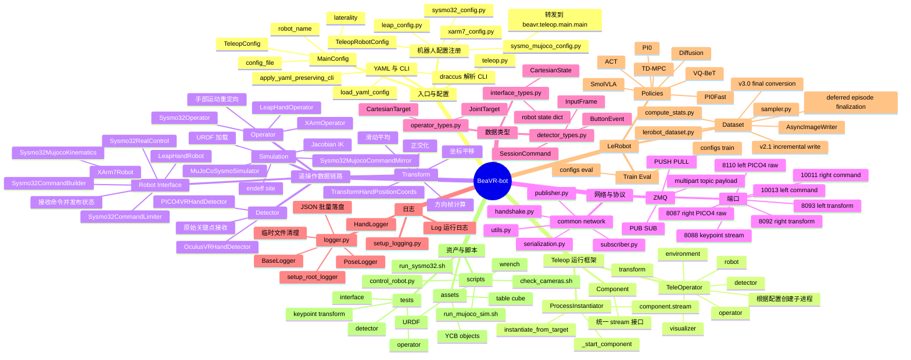
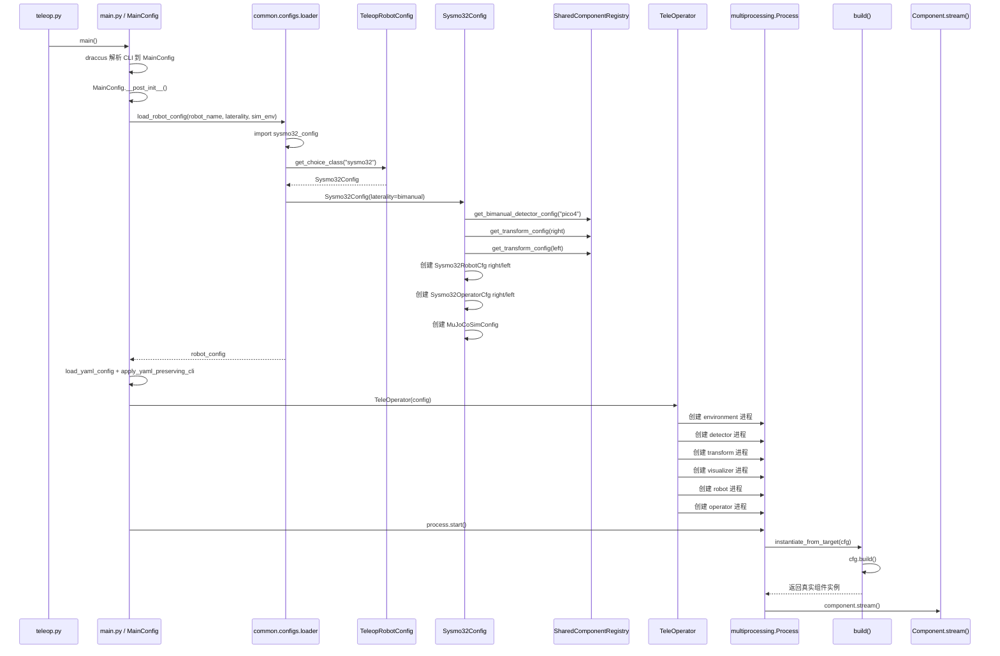
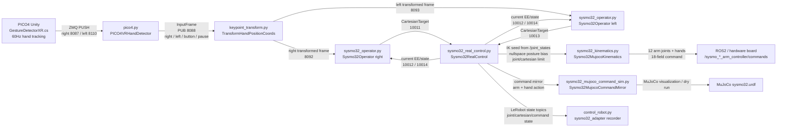
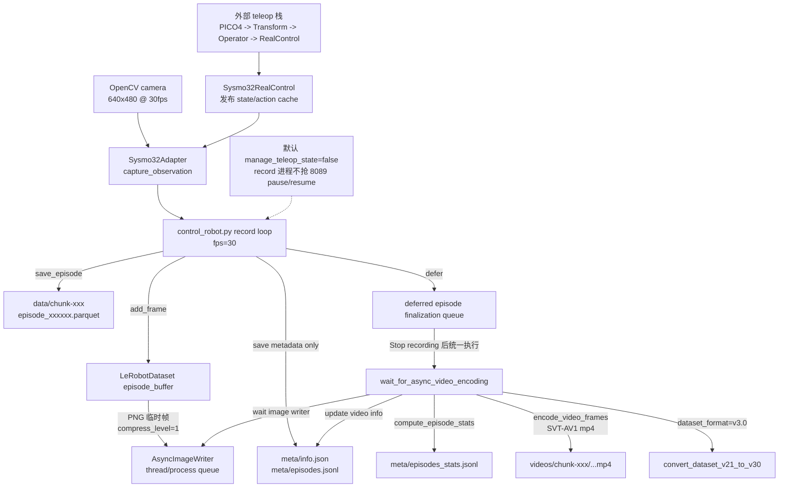
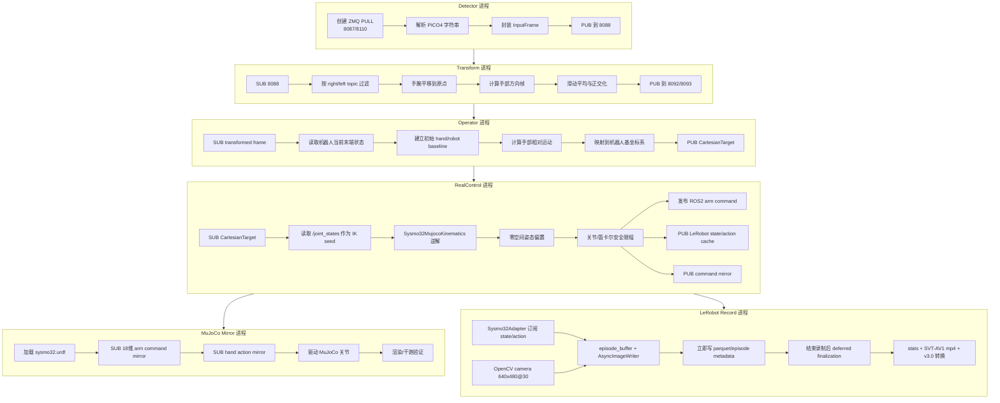

# BeaVR-bot 思维导图

这份图按“读代码”和“理解启动过程”的顺序组织：先看模块，再看初始化/实例化，最后看各子进程 `stream()` 之后在做什么。

## 模块总览



## 初始化与实例化过程

以这个启动命令为例：

```bash
python teleop.py --robot_name=sysmo32 --laterality=bimanual
```



## 核心运行链路



## LeRobot 录制链路



## 子进程启动后做什么



## 初始化关键点

- `MainConfig.__post_init__` 把 `robot_name/laterality/sim_env` 变成机器人配置对象。
- `TeleopRobotConfig.register_subclass("sysmo32")` 是机器人配置注册表；`--robot_name=sysmo32` 最终会查到 `Sysmo32Config`。
- `Sysmo32Config.__post_init__` 根据 `laterality` 填充 `detector/transforms/robots/operators/environment`。
- `SharedComponentRegistry` 复用共享 VR 组件配置，避免组合机器人重复创建同一只手的 detector/transform。
- `TeleOperator` 只负责把组件配置包装成多个 `multiprocessing.Process`。
- 子进程内调用 `instantiate_from_target(cfg)`；如果配置对象有 `build()`，就先构造真实组件，再调用组件的 `stream()`。

## 读代码建议顺序

1. [teleop.py](/home/likunwei/dataCollection/beavr-bot/teleop.py) 看入口如何转发到 `main()`。
2. [main.py](/home/likunwei/dataCollection/beavr-bot/src/beavr/teleop/main.py) 看 `MainConfig`、YAML/CLI 合并和进程启动。
3. [loader.py](/home/likunwei/dataCollection/beavr-bot/src/beavr/teleop/common/configs/loader.py) 看 `load_robot_config`、注册表查找和组合机器人合并。
4. [sysmo32_config.py](/home/likunwei/dataCollection/beavr-bot/src/beavr/teleop/configs/robots/sysmo32_config.py) 看 SYSMO-32 如何按 `laterality` 生成组件配置。
5. [shared_components.py](/home/likunwei/dataCollection/beavr-bot/src/beavr/teleop/configs/robots/shared_components.py) 看共享 VR 组件配置如何创建和复用。
6. [initializers.py](/home/likunwei/dataCollection/beavr-bot/src/beavr/teleop/components/initializers.py) 看 `TeleOperator` 如何把配置变成多个进程。
7. [instantiator.py](/home/likunwei/dataCollection/beavr-bot/src/beavr/teleop/common/factory/instantiator.py) 看 `build()` 和 `_target_` 的动态实例化规则。
8. [pico4.py](/home/likunwei/dataCollection/beavr-bot/src/beavr/teleop/components/detector/vr/pico4.py)、[keypoint_transform.py](/home/likunwei/dataCollection/beavr-bot/src/beavr/teleop/components/detector/vr/keypoint_transform.py)、[sysmo32_operator.py](/home/likunwei/dataCollection/beavr-bot/src/beavr/teleop/components/operator/robots/sysmo32_operator.py)、[sysmo32_robot.py](/home/likunwei/dataCollection/beavr-bot/src/beavr/teleop/components/interface/robots/sysmo32_robot.py)、[mujoco_sim.py](/home/likunwei/dataCollection/beavr-bot/src/beavr/teleop/components/simulation/mujoco_sim.py) 按数据流逐个读 `stream()`。
